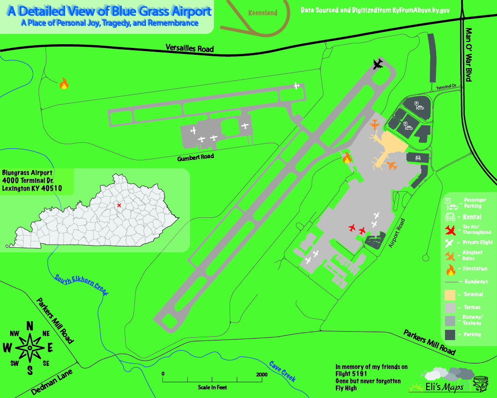
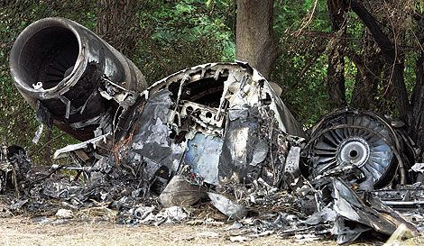

# Bluegrass Airport Map

A Digitized map of Bluegrass Airport, Lexington, Kentucky

## A Place of Personal Joy, Tragedy, and Remembrance

[Download a PDF of Bluegrass Airport Map](Airport.pdf)

Bluegrass Airport is Lexington's main airport for aerial transportation to places across the Central, Southern and Northern regions of the United States. LEX is where I began my training as a pilot, growing up with the goal of being a navy pilot. 

## Tragedy Struck

Sadly on August 27th, 2006 the flight  of Delta 5191, crashed when the aircraft took off from the wrong runway, crashing into a line of trees and exploding. Two of my friends were onboard and didn't survive.

Wreckage of the crash of 5191

https://www.popularmechanics.com/flight/a1264/4212159/ 

One of which was a pilot for AirTran and was a major inspiration for my pursuit of flying. I continued flying for 5 more years until as I grew older I could not fight the anxiety that was thinking of all those who died in the plane crash, and the dangers of flying.

Clarence Wayne "CW" Fortney II

https://www.claycity-times.com/news/?p=4159

## Remembrance Is the Best Thing to Do
Fast forward to this summer, I made the decision to leave my previous job and get a postion at the airport as a Ground Operations Agent for Allegiant Airlines. This was a tough decision, as it was the very site that my friends passed away, but it is where so many memories began. All the friends I made at aviation camp, the planes I got to fly, the museums I visited and the history I got to witness.

I have now helped over 150 flights take off from Bluegrass safely, and each plane I bring in, I get to work with people I care about, and who understand what this airport means to me. My friends are no longer with me, but I continue to remember them everytime I set foot on the tarmac at Bluegrass Airport.

Fly High CW and Carol

https://ejdunl55.github.io/bluegrass-airport-maap
